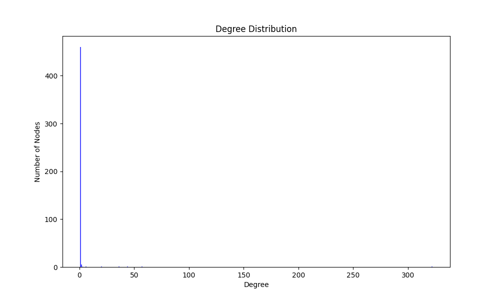

## Εισαγωγή

Σε αυτή την εργασία, αναλύουμε δεδομένα από το Twitter και το Stack Overflow χρησιμοποιώντας Python. Η ανάλυση περιλαμβάνει τη χρήση του Twitter API για την απόκτηση δεδομένων προφίλ και την ανάλυση ενός ego-network, καθώς και τη μελέτη ενός χρονικά μεταβαλλόμενου δικτύου από το Stack Overflow.

## Ερώτημα Α: Ανάλυση Δεδομένων από το Twitter API

### 1. Εγγραφή στο Twitter API

Για την πρόσβαση στα δεδομένα του Twitter μέσω του API, ακολουθήθηκαν τα εξής βήματα:

1. **Δημιουργία Λογαριασμού στο Twitter**: Δημιουργία λογαριασμού στο Twitter μέσω της ιστοσελίδας [twitter.com](https://twitter.com).
    
2. **Εγγραφή στο Developer Portal του Twitter**: Δημιουργία λογαριασμού για developers στο [Twitter Developer Portal](https://developer.twitter.com/). Η εγγραφή απαιτούσε τη συμπλήρωση μιας φόρμας με βασικές πληροφορίες για το σκοπό χρήσης του API και τη δημιουργία ενός Project.
    
3. **Δημιουργία του Twitter App**: Στη συνέχεια, μέσα στο Developer Portal, δημιουργήθηκε μια νέα εφαρμογή (App). Κατά τη δημιουργία της εφαρμογής, δημιουργήθηκαν τα εξής στοιχεία:
    
    - **API Key**: Ένας μοναδικός κωδικός που επιτρέπει την πρόσβαση στο API.
    - **API Secret Key**: Ένας κρυφός κωδικός που χρησιμοποιείται για την ασφάλεια των αιτημάτων.
    - **Bearer Token**: Ένα token που χρησιμοποιείται για την εξουσιοδότηση των αιτημάτων στο API.
      
4. **Δημιουργία Access Token και Access Token Secret**: Μετά τη δημιουργία της εφαρμογής, στην ενώτητα **Keys and Secrets** δημιουργήθηκαν τα κλειδία **Access Token** και **Access Token Secret**. Αυτά τα στοιχεία χρησιμοποιούνται για να επιτρέψουν στην εφαρμογή να κάνει αιτήματα στο API εκ μέρους του χρήστη. Αυτά τα tokens είναι απαραίτητα για την εξουσιοδότηση των ενεργειών που θα εκτελεθούν μέσω του API.

### 2. Δομή του Αντικειμένου `verifyCredentials`

Η `verifyCredentials` είναι ένα function που παρέχει το API το οποίο καλεί ένα endpoint για να εξακρυβώσει τα στοιχεία ενός χρήστη και αν αυτό γίνει με επιτυχία επιστρέφει διάφορα στοιχεία του.

Κάποια από τα στοιχεία που επιστρέφει είναι:

- **User ID**: Ένα μοναδικό αριθμητικό αναγνωριστικό για τον χρήστη στο Twitter.
- **Name**: Το όνομα του χρήστη όπως εμφανίζεται στο προφίλ του.
- **Screen Name**: Το μοναδικό ψευδώνυμο του χρήστη, το οποίο χρησιμοποιείται για την αναγνώρισή του στο Twitter (π.χ., @username).
- **Followers Count**: Ο αριθμός των χρηστών που ακολουθούν αυτόν τον λογαριασμό.
- **Friends Count**: Ο αριθμός των λογαριασμών που ακολουθεί ο συγκεκριμένος χρήστης.
- **Description**: Η περιγραφή ή το βιογραφικό του χρήστη, όπως αυτό έχει οριστεί στο προφίλ του.
- **Location**: Η τοποθεσία του χρήστη όπως την έχει δηλώσει στο προφίλ του.
- **Profile Image URL**: Το URL της εικόνας προφίλ του χρήστη, η οποία εμφανίζεται στο προφίλ του.

Η πλήρη δομή του αντικειμένου είναι η παρακάτω:

```json
{
    "id": 1052606945734156288,
    "id_str": "1052606945734156288",
    "name": "Gourou",
    "screen_name": "Gourou28474842",
    "location": "",
    "description": "",
    "url": null,
    "entities": {
        "description": {
            "urls": []
        }
    },
    "protected": false,
    "followers_count": 10,
    "friends_count": 36,
    "listed_count": 0,
    "created_at": "Wed Oct 17 17:07:07 +0000 2018",
    "favourites_count": 32,
    "utc_offset": null,
    "time_zone": null,
    "geo_enabled": false,
    "verified": false,
    "statuses_count": 37,
    "lang": null,
    "status": {
        "created_at": "Mon Jan 30 09:51:31 +0000 2023",
        "id": 1619996724046725123,
        "id_str": "1619996724046725123",
        "text": "@elonmusk Ω να σου",
        "truncated": false,
        "entities": {
            "hashtags": [],
            "symbols": [],
            "user_mentions": [
                {
                    "screen_name": "elonmusk",
                    "name": "Elon Musk",
                    "id": 44196397,
                    "id_str": "44196397",
                    "indices": [
                        0,
                        9
                    ]
                }
            ],
            "urls": []
        },

        "source": "<a href=\"http://twitter.com/download/android\" rel=\"nofollow\">Twitter for Android</a>",
        "in_reply_to_status_id": 1619773318915313664,
        "in_reply_to_status_id_str": "1619773318915313664",
        "in_reply_to_user_id": 44196397,
        "in_reply_to_user_id_str": "44196397",
        "in_reply_to_screen_name": "elonmusk",
        "geo": null,
        "coordinates": null,
        "place": null,
        "contributors": null,
        "is_quote_status": false,
        "retweet_count": 0,
        "favorite_count": 0,
        "favorited": false,
        "retweeted": false,
        "lang": "el"
    },
    "contributors_enabled": false,
    "is_translator": false,
    "is_translation_enabled": false,
    "profile_background_color": "000000",
    "profile_background_image_url": "http://abs.twimg.com/images/themes/theme1/bg.png",
    "profile_background_image_url_https": "https://abs.twimg.com/images/themes/theme1/bg.png",
    "profile_background_tile": false,
    "profile_image_url": "http://pbs.twimg.com/profile_images/1052610737225519105/Eh4Rf_WW_normal.jpg",
    "profile_image_url_https": "https://pbs.twimg.com/profile_images/1052610737225519105/Eh4Rf_WW_normal.jpg",
    "profile_banner_url": "https://pbs.twimg.com/profile_banners/1052606945734156288/1539796929",
    "profile_link_color": "FAB81E",
    "profile_sidebar_border_color": "000000",
    "profile_sidebar_fill_color": "000000",
    "profile_text_color": "000000",
    "profile_use_background_image": false,
    "has_extended_profile": false,
    "default_profile": false,
    "default_profile_image": false,
    "following": false,
    "follow_request_sent": false,
    "notifications": false,
    "translator_type": "none",
    "withheld_in_countries": [],
    "suspended": false,
    "needs_phone_verification": false
}
```

### 3. Κώδικας για Λήψη Δεδομένων

Για την λήψη δεδομένων από το twitter API έγινε χρήση της βιβλιοθήκης [tweepy](https://www.tweepy.org/). Παρακάτω είναι ο κώδικας που χρησιμοποήθηκε.

```python
import json
import tweepy

# Ορισμός των κλειδιών του API
CONSUMER_KEY = '...'
CONSUMER_SECRET = '...'
ACCESS_TOKEN_KEY = '...'
ACCESS_TOKEN_SECRET = '...'

def create_tweepy_api() -> tweepy.API:
	'''Δημιουργία tweepy API'''
	
	auth = tweepy.OAuth1UserHandler(
		CONSUMER_KEY,
		CONSUMER_SECRET,
		ACCESS_TOKEN_KEY,
		ACCESS_TOKEN_SECRET
	)
	api = tweepy.API(auth)
	return api

def print_user_info(user_info: tweepy.models.User) -> None:
	'''Εκτύπωση των πληροφοριών του χρήστη'''
	
	print("User ID:", user_info.id)
	print("Name:", user_info.name)
	print("Screen Name:", user_info.screen_name)
	print("Followers Count:", user_info.followers_count)
	print("Friends Count:", user_info.friends_count)
	print("Description:", user_info.description)
	print("Location:", user_info.location)
	print("Profile Image URL:", user_info.profile_image_url_https)
	
	# Εκτύπωση του πλήρους JSON για ανάλυση
	print("\nFull JSON response:")
	print(json.dumps(user_info._json, indent=4, sort_keys=True))


def main() -> None:
	try:
		# Δημιουργία αντικειμένου API
		api = create_tweepy_api()
		
		# Επαλήθευση στοιχείων και εκτύπωση πληροφοριών
		user_info = api.verify_credentials()
		print_user_info(user_info)
		
	except tweepy.Unauthorized as tu:
		print("Unauthorized access. Please check your API keys.")
	except Exception as e:
		 print("An unexpected error occurred. Please check the logs for more details.")


if __name__ == '__main__':
	main()
```

- Σύντομη περιγραφή του κώδικα.

## Ερώτημα Β: Ανάλυση Ego-network

### 1. Ανάγνωση και Δημιουργία Δικτύου από Δεδομένα

Το αρχείο `ego_sep24.csv` περιέχει δεδομένα από το προφίλ του διδάσκοντα (georgedim86), το οποίο έχει διασυνδέσεις στους φίλους του και φίλους των φίλων του. Αυτά τα δεδομένα αναπαριστούν ένα κοινωνικό δίκτυο, το οποίο μπορούμε να αναλύσουμε και να απεικονίσουμε χρησιμοποιώντας διάφορες βιβλιοθήκες της Python.

Δήλωση των βιβλιοθηκών για τον κώδικα:

```python
import pandas as pd 
import numpy as np 
import networkx as nx 
import matplotlib.pyplot as plt
```

#### Ανάγνωση αρχείου ``ego_sep24.csv``

Ο παρακάτω κώδικας διαβάζει τα δεδομένα από το αρχείο `ego_sep24.csv` και δημιουργεί ένα γράφημα χρησιμοποιώντας τη βιβλιοθήκη `networkx`.

```python
def create_network_from_csv(file_path: str) -> nx.Graph:
    '''Δημιουργία ενός κατευθυνόμενου γράφου από τα δεδομένα του αρχείου CSV'''
    
    # Ανάγνωση των δεδομένων από το αρχείο CSV
    df = pd.read_csv(file_path)
    
    # Δημιουργία ενός μη κατευθυνόμενου γράφου από τα δεδομένα
    G = nx.from_pandas_edgelist(df, source='source', target='target', create_using=nx.Graph())
    
    return G
```

**Διαδικασία Ανάγνωσης Δεδομένων**:

- Το αρχείο `ego_sep24.csv` φορτώνεται σε ένα DataFrame χρησιμοποιώντας τη βιβλιοθήκη `pandas`. Το DataFrame περιέχει δύο στήλες, `source` και `target`, οι οποίες αντιπροσωπεύουν τις διασυνδέσεις μεταξύ των κόμβων στο δίκτυο.
- Στη συνέχεια, χρησιμοποιούμε τη συνάρτηση `nx.from_pandas_edgelist` για να δημιουργήσουμε ένα μη κατευθυνόμενο γράφημα (`nx.Graph()`), όπου κάθε ζεύγος (`source`, `target`) αντιπροσωπεύει μια ακμή (διασύνδεση) στο δίκτυο.

#### Απεικόνιση του Δικτύου

Αφού δημιουργηθεί το δίκτυο, μπορούμε να το απεικονίσουμε χρησιμοποιώντας τη βιβλιοθήκη `matplotlib`:

```python
def plot_network_graph(G: nx.Graph):
    '''Απεικόνιση γράφου'''
    
    plt.figure()
    # Διάταξη των κόμβων χρησιμοποιώντας τον αλγόριθμο spring_layout
    pos = nx.spring_layout(G)
    
    # Σχεδιασμός των κόμβων
    nodes = nx.draw_networkx_nodes(G, pos, alpha=0.8)
    nodes.set_edgecolor('k')
    
    # Σχεδιασμός των ετικετών των κόμβων
    nx.draw_networkx_labels(G, pos, font_size=8)
    
    # Σχεδιασμός των ακμών του δικτύου
    nx.draw_networkx_edges(G, pos, width=1.0, alpha=0.2)
    
    # Εμφάνιση του γραφήματος
    plt.show()
```

**Διαδικασία Απεικόνισης Δικτύου**:

- Η συνάρτηση `plot_network_graph()` χρησιμοποιεί τη διάταξη `spring_layout`, η οποία βασίζεται σε μια φυσική προσομοίωση ελατηρίων για την τοποθέτηση των κόμβων στο χώρο, δημιουργώντας μια αισθητικά ευχάριστη απεικόνιση.
- Οι κόμβοι σχεδιάζονται με μαύρο περίγραμμα και ελαφρώς διαφανή εμφάνιση (`alpha=0.8`), ενώ οι ακμές σχεδιάζονται με χαμηλή διαφάνεια για να αποφευχθεί η υπερβολική οπτική φόρτωση.
- Οι ετικέτες των κόμβων εμφανίζονται με μικρό μέγεθος γραμματοσειράς (`font_size=8`) για να διευκολύνουν την αναγνώριση των κόμβων.

**Απεικόνιση Γράφου**:


### 2. Κόμβοι και Ακμές του Δικτύου

Μετά τη δημιουργία του δικτύου από τα δεδομένα του αρχείου `ego_sep24.csv`, η επόμενη ενέργεια είναι η καταμέτρηση των κόμβων και των ακμών του δικτύου. Η καταμέτρηση αυτή είναι σημαντική γιατί μας δίνει μια βασική ιδέα για το μέγεθος και την πολυπλοκότητα του δικτύου.

Ο παρακάτω κώδικας χρησιμοποιεί τη συνάρτηση `count_nodes_and_edges()` για να υπολογίσει τον αριθμό των κόμβων και των ακμών στο γράφο:

```python
def count_nodes_and_edges(G: nx.Graph) -> tuple:
    '''Καταμέτρηση των κόμβων και των ακμών στο γράφο'''
	
    num_nodes = G.number_of_nodes()
    num_edges = G.number_of_edges()
    return num_nodes, num_edges
```

- **Αναφορά του αριθμού κόμβων και ακμών**:
    - Η συνάρτηση `number_of_nodes()` επιστρέφει τον συνολικό αριθμό των κόμβων στο γράφημα.
    - Η συνάρτηση `number_of_edges()` επιστρέφει τον συνολικό αριθμό των ακμών στο γράφημα.

Παραδείγματος χάριν, κατά την εκτέλεση του κώδικα μπορεί να παρατηρήσετε:

```
Number of nodes: 472 
Number of edges: 479
```

Αυτή η πληροφορία δείχνει πόσες οντότητες (κόμβοι) υπάρχουν στο δίκτυο και πόσες σχέσεις (ακμές) υπάρχουν μεταξύ αυτών.

### 3. Υπολογισμός Μετρικών του Γράφου

Για να αναλύσουμε περαιτέρω το δίκτυο, υπολογίζουμε σημαντικές μετρικές του γράφου. Αυτές οι μετρικές μας βοηθούν να κατανοήσουμε τη δομή και τα χαρακτηριστικά του δικτύου.

Δημιουργήθηκε η παρακάτω δομή δεδομένων για την αναπαράσταση της πληροφορίας των μετρήσεων του γράφου

```python
from dataclasses import dataclass

@dataclass
class GraphMetrics:
	avg_degree: float
	avg_shortest_path_length: float
	avg_clustering_coefficient: float
	
	def __str__(self) -> str:
		return (f"Graph Metrics: \n"
				f"  Average Degree: {self.avg_degree:.2f} \n"
				f"  Characteristic Path Length: {self.avg_shortest_path_length:.2f} \n"
				f"  Average Clustering Coefficient: {self.avg_clustering_coefficient:.2f}")
```

Ο παρακάτω κώδικας υπολογίζει τις κύριες μετρικές του γράφου:

```python
def calculate_graph_metrics(G: nx.Graph) -> GraphMetrics:
    '''Υπολογισμός των μετρικών του γράφου'''
    avg_degree = np.mean([degree for node, degree in G.degree()])
    
    return GraphMetrics(
        avg_degree=avg_degree,
        avg_shortest_path_length=nx.average_shortest_path_length(G),
        avg_clustering_coefficient=nx.average_clustering(G)
    )
```

- **Μέσος Βαθμός**: Ο μέσος αριθμός ακμών που συνδέουν κάθε κόμβο στο δίκτυο. Υπολογίζεται με το μέσο όρο των βαθμών όλων των κόμβων.
    
- **Χαρακτηριστικό Μήκος Μονοπατιού**: Το μέσο μήκος του συντομότερου μονοπατιού μεταξύ όλων των ζευγών κόμβων στο δίκτυο. Υπολογίζεται με τη συνάρτηση `nx.average_shortest_path_length()`.
    
- **Μέσος Συντελεστής Συσταδοποίησης**: Ένα μέτρο του πόσο κοντά είναι οι γείτονες ενός κόμβου να σχηματίζουν κλειστούς κύκλους ή τρίγωνα. Υπολογίζεται με τη συνάρτηση `nx.average_clustering()`.


Παράδειγμα εξόδου:

```
Graph Metrics: 
  Average Degree: 2.03 
  Characteristic Path Length: 2.96 
  Average Clustering Coefficient: 0.00
```

Αυτές οι μετρικές δείχνουν τη συνολική διασυνδεσιμότητα και τη συνοχή του δικτύου.

### 4. Κατανομή Βαθμών
Η κατανομή βαθμών είναι ένα σημαντικό διάγραμμα που δείχνει πώς κατανέμονται οι βαθμοί των κόμβων σε ένα δίκτυο. Με άλλα λόγια, μας δείχνει πόσοι κόμβοι έχουν συγκεκριμένο αριθμό συνδέσεων.

Ο παρακάτω κώδικας δημιουργεί το διάγραμμα κατανομής βαθμών:

```python
def plot_degree_distribution(G: nx.Graph):
    '''Απεικόνιση της κατανομής των βαθμών των κόμβων'''
    
    degree_sequence = sorted([degree for node, degree in G.degree()], reverse=True)
    degree_count = pd.Series(degree_sequence).value_counts().sort_index()

    plt.figure(figsize=(10, 6))
    plt.bar(degree_count.index, degree_count.values, color='b', alpha=0.7)
    plt.title("Degree Distribution")
    plt.xlabel("Degree")
    plt.ylabel("Number of Nodes")
    plt.show()

```

- **Παρουσίαση του διαγράμματος κατανομής βαθμών**:
    - Το διάγραμμα κατανομής βαθμών παρουσιάζει τον αριθμό των κόμβων για κάθε πιθανό βαθμό (αριθμός συνδέσεων).
    - Η κατανομή μπορεί να είναι κεντροποιημένη γύρω από μια συγκεκριμένη τιμή ή να ακολουθεί μια πιο κατανεμημένη μορφή, ανάλογα με τη δομή του δικτύου.

**Απεικόνιση Διαγράμματος**



Παρατηρήσεις:

- Αν η κατανομή έχει πολλούς κόμβους με λίγες συνδέσεις και λίγους κόμβους με πολλές συνδέσεις, αυτό υποδηλώνει μια δομή δικτύου τύπου "scale-free".
- Αν η κατανομή είναι περισσότερο ομοιόμορφη, αυτό υποδηλώνει ότι οι κόμβοι είναι περισσότερο εξισορροπημένοι ως προς τον αριθμό συνδέσεών τους.


O πλήρης κώδικας:

```python
from dataclasses import dataclass
import pandas as pd
import numpy as np
import networkx as nx
import matplotlib.pyplot as plt

@dataclass
class GraphMetrics:
    avg_degree: float
    avg_shortest_path_length: float
    avg_clustering_coefficient: float

    def __str__(self) -> str:
        return (f"Graph Metrics: \n"
                f"  Average Degree: {self.avg_degree:.2f} \n"
                f"  Characteristic Path Length: {self.avg_shortest_path_length:.2f} \n"
                f"  Average Clustering Coefficient: {self.avg_clustering_coefficient:.2f}")

def create_network_from_csv(file_path: str) -> nx.Graph:
    '''Δημιουργία ενός κατευθυνόμενου γράφου από τα δεδομένα του αρχείου CSV'''
   
    df = pd.read_csv(file_path)
    G = nx.from_pandas_edgelist(df, source='source', target='target', create_using=nx.Graph())
    
    return G

def count_nodes_and_edges(G: nx.Graph) -> tuple:
    '''Καταμέτρηση των κόμβων και των ακμών στο γράφο'''

    num_nodes = G.number_of_nodes()
    num_edges = G.number_of_edges()
    return num_nodes, num_edges

def calculate_graph_metrics(G: nx.Graph) -> GraphMetrics:
    '''Υπολογισμός των μετρικών του γράφου'''
    
    avg_degree = np.mean([degree for node, degree in G.degree()])
    
    return GraphMetrics(
        avg_degree=avg_degree,
        avg_shortest_path_length=nx.average_shortest_path_length(G),
        avg_clustering_coefficient=nx.average_clustering(G)
    )

def plot_network_graph(G: nx.Graph):
    '''Απεικόνιση γράφου'''
    
    plt.figure()
    pos = nx.spring_layout(G)
    nodes = nx.draw_networkx_nodes(G, pos, alpha=0.8)
    nodes.set_edgecolor('k')
    nx.draw_networkx_labels(G, pos, font_size=8)
    nx.draw_networkx_edges(G, pos, width=1.0, alpha=0.2)
    plt.show()

def plot_degree_distribution(G: nx.Graph):
    '''Απεικόνιση της κατανομής των βαθμών των κόμβων'''
    
    degree_sequence = sorted([degree for node, degree in G.degree()], reverse=True)
    degree_count = pd.Series(degree_sequence).value_counts().sort_index()

    plt.figure(figsize=(10, 6))
    plt.bar(degree_count.index, degree_count.values, color='b', alpha=0.7)
    plt.title("Degree Distribution")
    plt.xlabel("Degree")
    plt.ylabel("Number of Nodes")
    plt.show()

if __name__ == "__main__":
    file_path = 'data/ego_sep24.csv'

    # 1) Δημιουργία του γράφου από το CSV
    G = create_network_from_csv(file_path)

    # 2) Καταμέτρηση των κόμβων και ακμών στο δίκτυο
    num_nodes, num_edges = count_nodes_and_edges(G)
    print(f"Number of nodes: {num_nodes}")
    print(f"Number of edges: {num_edges}")

    # 3) Υπολογισμός και εμφάνιση των μετρικών του γράφου
    metrics = calculate_graph_metrics(G)
    print(metrics)

    # 4) Απεικόνιση του γράφου
    plot_network_graph(G)

    # 5) Απεικόνιση της κατανομής των βαθμών και παρατηρήσεις
    plot_degree_distribution(G)

```

## Ερώτημα Γ: Ανάλυση Δικτύου από το Stack Overflow

Σε αυτό το ερώτημα, θα αναλύσουμε ένα χρονικά μεταβαλλόμενο δίκτυο από την ιστοσελίδα Stack Overflow. Το δίκτυο αυτό περιλαμβάνει δεδομένα που καταγράφουν αλληλεπιδράσεις μεταξύ χρηστών, όπως ερωτήσεις και απαντήσεις, με πληροφορίες σχετικά με τον χρόνο που συνέβησαν αυτές οι αλληλεπιδράσεις.

### 1. Διαχωρισμός Χρόνου σε Διαστήματα

Αρχικά, τα δεδομένα χωρίστηκαν σε 4 χρονικά διαστήματα για να μελετήσουμε την εξέλιξη του δικτύου σε διαφορετικές χρονικές περιόδους. Ο διαχωρισμός του χρόνου έγινε με τη χρήση της συνάρτησης `pd.qcut`, η οποία διαχωρίζει τα δεδομένα σε ισομεγέθη διαστήματα με βάση τις χρονικές σημάνσεις.

```python
def load_data():
    '''Φόρτωση των δεδομένων από το αρχείο και διαχωρισμός τους σε χρονικά διαστήματα'''
    
    # Φόρτωση των δεδομένων
    data = pd.read_csv('data\sx-stackoverflow-a2q.txt.gz', compression='gzip', sep=' ', header=None, names=['source', 'target', 'timestamp'])
    data = data.head(DATA_COUNT)
    
    # Διαχωρισμός των δεδομένων σε χρονικά διαστήματα
    time_intervals = pd.qcut(data['timestamp'], TIME_INTERVAL_SLICES, labels=False)
    data['time_interval'] = time_intervals
    
    return data

```

**Περιγραφή του τρόπου διαχωρισμού του χρόνου και της δημιουργίας των επιμέρους γράφων**:

- Τα δεδομένα φορτώνονται από το αρχείο `sx-stackoverflow-a2q.txt.gz` και τα πρώτα 20.000 εγγραφές διατηρούνται για ανάλυση.
- Το πεδίο `timestamp` χρησιμοποιείται για τον διαχωρισμό των δεδομένων σε 4 ίσα χρονικά διαστήματα, με τη βοήθεια της συνάρτησης `pd.qcut`. Αυτό επιτρέπει την ανάλυση του δικτύου σε διαφορετικές χρονικές περιόδους.

### 2. Κόμβοι και Ακμές σε Κάθε Διάστημα

Στη συνέχεια, δημιουργούνται ξεχωριστοί γράφοι για κάθε χρονικό διάστημα και υπολογίζονται ο αριθμός των κόμβων και των ακμών για κάθε έναν από αυτούς.

```python
def create_graph_data(data):
    '''Δημιουργία γράφων από τα δεδομένα και υπολογισμός κόμβων και ακμών'''
   
    graphs = []
    node_counts = []
    edge_counts = []

    for i in range(TIME_INTERVAL_SLICES):
        # Φιλτράρισμα των δεδομένων για το τρέχον χρονικό διάστημα
        interval_data = data[data['time_interval'] == i]
        
        # Δημιουργία γράφου από τα δεδομένα
        G = nx.from_pandas_edgelist(interval_data, source='source', target='target', create_using=nx.DiGraph())
        graphs.append(G)
        
        # Σύνολο κόμβων και ακμών
        node_counts.append(G.number_of_nodes())
        edge_counts.append(G.number_of_edges())
    
    return graphs, node_counts, edge_counts

```

**Παρουσίαση της εξέλιξης των κόμβων και των ακμών σε διάγραμμα**:

- Για κάθε χρονικό διάστημα, δημιουργείται ένας κατευθυνόμενος γράφος χρησιμοποιώντας τις αλληλεπιδράσεις μεταξύ χρηστών.
- Υπολογίζεται ο αριθμός των κόμβων και των ακμών για κάθε γράφο, αποτυπώνοντας την εξέλιξη του δικτύου σε διαφορετικές χρονικές περιόδους.

Για την οπτικοποίηση αυτής της εξέλιξης, χρησιμοποιείται η συνάρτηση `plot_evolution_over_time`:

```python
def plot_evolution_over_time(node_counts, edge_counts):
    '''Απεικόνιση της εξέλιξης των κόμβων και των ακμών με το χρόνο'''

    plt.figure(figsize=(10, 6))
    plt.plot(range(1, TIME_INTERVAL_SLICES + 1), node_counts, label='Number of Nodes')
    plt.plot(range(1, TIME_INTERVAL_SLICES + 1), edge_counts, label='Number of Edges')
    plt.xlabel('Time Interval')
    plt.ylabel('Count')
    plt.title('Evolution of Nodes and Edges Over Time')
    plt.legend()
    plt.show()

```

Το διάγραμμα αυτό παρουσιάζει την αύξηση ή μείωση του αριθμού των κόμβων και των ακμών καθώς εξελίσσεται το δίκτυο με την πάροδο του χρόνου.

**Απεικόνιση Διαγράμματος**:


### 3. Κατανομή Βαθμών για Κάθε Διάστημα

Για κάθε χρονικό διάστημα, η κατανομή των βαθμών των κόμβων απεικονίζεται σε ιστογράμματα. Αυτό δείχνει πόσο διασυνδεδεμένοι είναι οι κόμβοι σε κάθε χρονική περίοδο.

```python
def plot_degree_distribution(graphs):
    '''Απεικόνιση της κατανομής των βαθμών των κόμβων για κάθε χρονικό διάστημα'''

    for i, G in enumerate(graphs):
        degrees = [G.degree(n) for n in G.nodes()]
        plt.figure(figsize=(10, 6))
        plt.hist(degrees, bins=30)
        plt.title(f'Degree Distribution for Interval {i + 1}')
        plt.xlabel('Degree')
        plt.ylabel('Frequency')
        plt.show()
```

**Παρουσίαση των διαγραμμάτων κατανομής βαθμών για κάθε διάστημα**:

- Κάθε γράφος έχει διαφορετική κατανομή βαθμών, η οποία δείχνει πώς κατανέμονται οι συνδέσεις μεταξύ των κόμβων στο δίκτυο.
- Το διάγραμμα βοηθά στην κατανόηση της δομής του δικτύου σε κάθε χρονική περίοδο, αποκαλύπτοντας αν υπάρχουν κόμβοι με πολλές ή λίγες συνδέσεις.

**Απεικόνιση Διαγραμμάτων**

1. **Χρονικό Διάστημα 1**
   
   

2. **Χρονικό Διάστημα 2**
   
   

3. **Χρονικό Διάστημα 3**
   
   

4. **Χρονικό Διάστημα 4**
   
   


### 4. Συνδεδεμένες Συνιστώσες

Για κάθε χρονικό διάστημα, υπολογίζεται ο αριθμός των συνδεδεμένων συνιστωσών του δικτύου, κάτι που μας δείχνει πόσο διασυνδεδεμένο είναι το δίκτυο.

```python
def print_connected_components(graphs):
    '''Εκτύπωση του αριθμού των συνδεδεμένων συνιστωσών για κάθε χρονικό διάστημα'''

    for i, G in enumerate(graphs):
        if nx.is_connected(G.to_undirected()):
            print(f"Interval {i + 1}: All users are connected.")
        else:
            components = nx.number_connected_components(G.to_undirected())
            print(f"Interval {i + 1}: Number of connected components = {components}")

```

**Παρουσίαση του αριθμού των συνδεδεμένων συνιστωσών για κάθε διάστημα**:

- Αν το δίκτυο είναι πλήρως συνδεδεμένο, σημαίνει ότι κάθε χρήστης μπορεί να φτάσει σε οποιονδήποτε άλλον μέσω των συνδέσεων. Αν όχι, το δίκτυο χωρίζεται σε διάφορες συνιστώσες.
- Ο αριθμός των συνδεδεμένων συνιστωσών μπορεί να αποκαλύψει την ύπαρξη απομονωμένων ομάδων χρηστών σε συγκεκριμένα χρονικά διαστήματα.

### 5. Κοινοί Κόμβοι μεταξύ Διαστημάτων

Η συνάρτηση αυτή υπολογίζει το πλήθος των κόμβων που παραμένουν στο δίκτυο από το ένα χρονικό διάστημα στο επόμενο, βοηθώντας μας να κατανοήσουμε τη σταθερότητα του δικτύου με την πάροδο του χρόνου.

```python
def print_common_nodes(graphs):
    '''Εκτύπωση του πλήθους των κοινών κόμβων μεταξύ διαδοχικών χρονικών διαστημάτων'''

    common_nodes = []
    for i in range(TIME_INTERVAL_SLICES - 1):
        common = len(set(graphs[i].nodes()).intersection(set(graphs[i + 1].nodes())))
        common_nodes.append(common)

    print("Common nodes between consecutive intervals:", common_nodes)

```

**Παρουσίαση του πλήθους των κοινών κόμβων μεταξύ διαστημάτων**:

- Ο αριθμός των κοινών κόμβων μεταξύ διαστημάτων δείχνει πόσοι χρήστες παραμένουν ενεργοί στο δίκτυο με την πάροδο του χρόνου.
- Αυτή η πληροφορία είναι χρήσιμη για να κατανοήσουμε τη συνοχή του δικτύου και πόσο συχνά οι χρήστες παραμένουν συνδεδεμένοι μεταξύ των διαφόρων περιόδων.


O πλήρης κώδικας:

```python
import pandas as pd
import networkx as nx
import matplotlib.pyplot as plt
  

# Constants
DATA_COUNT = 20_000
TIME_INTERVAL_SLICES = 4


def load_data():
	'''Φόρτωση των δεδομένων από το αρχείο και διαχωρισμός τους σε χρονικά διαστήματα'''

	# Φόρτωση των δεδομένων
	data = pd.read_csv('data\sx-stackoverflow-a2q.txt.gz', compression='gzip', sep=' ', header=None, names=['source', 'target', 'timestamp'])
	data = data.head(DATA_COUNT)

	# Διαχωρισμός των δεδομένων σε χρονικά διαστήματα
	time_intervals = pd.qcut(data['timestamp'], TIME_INTERVAL_SLICES, labels=False)
	data['time_interval'] = time_intervals

	return data


def create_graph_data(data):
	'''Δημιουργία γράφων από τα δεδομένα και υπολογισμός κόμβων και ακμών'''

	graphs = []
	node_counts = []
	edge_counts = []

	for i in range(TIME_INTERVAL_SLICES):
        
		# Φιλτράρισμα των δεδομένων για το τρέχον χρονικό διάστημα
		interval_data = data[data['time_interval'] == i]

		# Δημιουργία γράφου από τα δεδομένα
		G = nx.from_pandas_edgelist(interval_data, source='source', target='target', create_using=nx.DiGraph())
		graphs.append(G)

		# Σύνολο κόμβων και ακμών
		node_counts.append(G.number_of_nodes())
		edge_counts.append(G.number_of_edges())

	return graphs, node_counts, edge_counts

  

def plot_evolution_over_time(node_counts, edge_counts):
	'''Απεικόνιση της εξέλιξης των κόμβων και των ακμών με το χρόνο'''	

	plt.figure(figsize=(10, 6))
	plt.plot(range(1, TIME_INTERVAL_SLICES + 1), node_counts, label='Number of Nodes')
	plt.plot(range(1, TIME_INTERVAL_SLICES + 1), edge_counts, label='Number of Edges')
	plt.xlabel('Time Interval')
	plt.ylabel('Count')
	plt.title('Evolution of Nodes and Edges Over Time')
	plt.legend()
	plt.show()


def plot_degree_distribution(graphs):
	'''Απεικόνιση της κατανομής των βαθμών των κόμβων για κάθε χρονικό διάστημα'''

	for i, G in enumerate(graphs):
		degrees = [G.degree(n) for n in G.nodes()]
		plt.figure(figsize=(10, 6))
		plt.hist(degrees, bins=30)
		plt.title(f'Degree Distribution for Interval {i + 1}')
		plt.xlabel('Degree')
		plt.ylabel('Frequency')
		plt.show()


def print_connected_components(graphs):
	'''Εκτύπωση του αριθμού των συνδεδεμένων συνιστωσών για κάθε χρονικό διάστημα'''
	
	for i, G in enumerate(graphs):
		if nx.is_connected(G.to_undirected()):
			print(f"Interval {i + 1}: All users are connected.")
		else:
			components = nx.number_connected_components(G.to_undirected())
			print(f"Interval {i + 1}: Number of connected components = {components}")
  

def print_common_nodes(graphs):
	'''Εκτύπωση του πλήθους των κοινών κόμβων μεταξύ διαδοχικών χρονικών διαστημάτων'''
	
	common_nodes = []
	for i in range(TIME_INTERVAL_SLICES - 1):
		common = len(set(graphs[i].nodes()).intersection(set(graphs[i + 1].nodes())))
		common_nodes.append(common)
	
	print("Common nodes between consecutive intervals:", common_nodes)

  
if __name__ == "__main__":

	# Φόρτωση και προετοιμασία των δεδομένων
	data = load_data()
	
	# Δημιουργία γράφων και υπολογισμός κόμβων και ακμών
	graphs, node_counts, edge_counts = create_graph_data(data)
	
	# Διάγραμμα εξέλιξης κόμβων και ακμών
	plot_evolution_over_time(node_counts, edge_counts)
	
	# Διάγραμμα κατανομής βαθμών
	plot_degree_distribution(graphs)
	
	# Έλεγχος σύνδεσης χρηστών και υπολογισμός συνδεδεμένων συνιστωσών
	print_connected_components(graphs)
	
	# Υπολογισμός πλήθους κοινών κόμβων
	print_common_nodes(graphs)
```


## Βιβλιοθήκες Ανάπτυξης Κώδικα

- **[tweepy](https://www.tweepy.org/)**: Χρησιμοποιείται για την αλληλεπίδραση με το Twitter API. 
	
- **[pandas](https://pandas.pydata.org/)**: Χρησιμοποιείται για την ανάγνωση και την επεξεργασία των δεδομένων από διάφορους τύπους αρχείων όπως CSV, txt κτλ. Παρέχει ισχυρά εργαλεία για τη διαχείριση δεδομένων σε μορφή πίνακα.
    
- **[numpy](https://numpy.org/)**: Χρησιμοποιείται για μαθηματικές λειτουργίες και διαχείριση πινάκων. Ενώ δεν είναι άμεσα απαραίτητη σε αυτήν την περίπτωση, μπορεί να χρησιμοποιηθεί για τυχόν περαιτέρω μαθηματικές επεξεργασίες.
    
- **[networkx](https://networkx.org/)**: Χρησιμοποιείται για τη δημιουργία, χειρισμό και ανάλυση των γραφημάτων και δικτύων. Αυτή η βιβλιοθήκη μας επιτρέπει να δημιουργήσουμε ένα γράφημα από τα δεδομένα και να υπολογίσουμε διάφορες μετρικές του δικτύου.
    
- **[matplotlib](https://matplotlib.org/)**: Χρησιμοποιείται για την απεικόνιση του δικτύου. Παρέχει εργαλεία για τη δημιουργία γραφημάτων και διαγραμμάτων.


Τα scripts για την εργασία είναι επίσης διαθέσιμα στο παρακάτω github repository: https://github.com/lefpap/social-networks